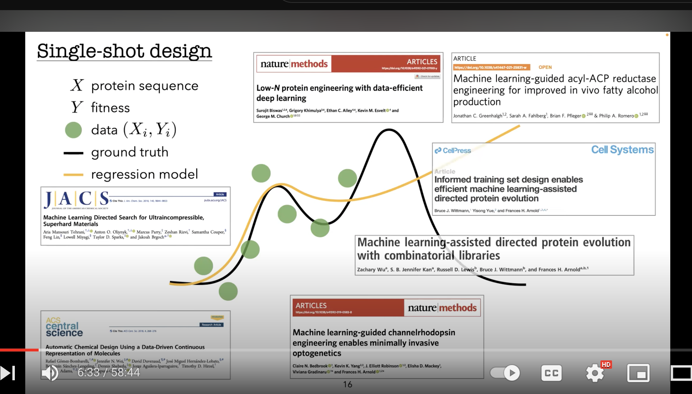
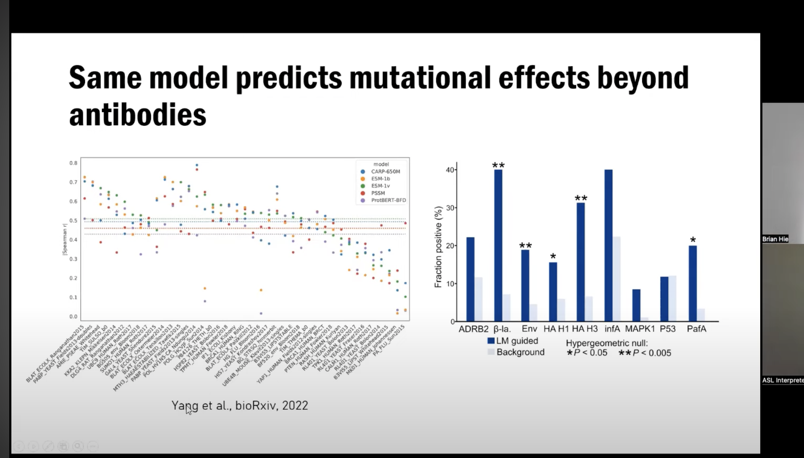

# [Machine Learning-Assisted Protein Engineering with ftMLDE and evSeq](https://www.youtube.com/watch?v=hae6IpcDCc0&t=2s&ab_channel=MLforproteinengineeringseminarseries)

- Directed evolution: mutate wt, screen for fitness, select best
  - Slow and often stuck in local min (greedy)
- ML can help extrapolate.
  - Need to sequence 
- Problem: mutational scanning creates a ton of non-functional variants that add noise. 
- Using a simulation, he shows that even a weakly more focused training set will be extremely useful for improving predictions.
  - *Key Takeaway*: Filtering out proteins worse than 1% of the max (so 1st percentile proteins) at least 50% of the time, was enough to substantially improve results.
  - This was a simulation using sequences with known fitness, in real life we don't know the fitness a priori but...
  - use a 'zero shot' learner, even a really bad one will help a lot.
    - He tested two strategies, two worked:
      - Local MSAs
        - Worked! EVmutation
        - DeepSequence
      - Global LLMs
        - ESM
        - ProtBert and ProtBert-BFD
        - Worked! The MSA transformer
	- Rational modeling (protein stability using Triad) worked as well
- Used different representations: one hot, Giorgiev, and MSA Transformer
- https://www.biorxiv.org/content/10.1101/2020.12.04.408955v1.full.pdf

- Check out Jax protein mpnn (Sergey) for generating sequences

# [Conformal prediction under feedback covariate shift for biomolecular design](https://www.youtube.com/watch?v=AOyDjBSQjhk&ab_channel=MLforproteinengineeringseminarseries)

[Paper](https://www.pnas.org/doi/10.1073/pnas.2204569119)

- How to trust model-based protein selection, even though models don't usually extrapolate well.
- methods of optimizing model output: genetic algo, gradient based, or conditional generative model see  Biswas et al 2021 https://youtu.be/AOyDjBSQjhk?t=2618
- they have an algorithm for characterizing uncertainty in any model's predictions
- Training and Design data become statistically dependent

# https://youtu.be/2yS3jydA8Ls?t=1490 example of choosing sequences

# [Efficient evolution of human antibodies from general protein language models and sequence information alone](https://www.youtube.com/watch?v=7szFo_IPUcE&ab_channel=MLforproteinengineeringseminarseries)

https://www.biorxiv.org/content/10.1101/2022.04.10.487811v1

- Use past evolution to guide future evolution using LLMs
- Need to test not just for binding, but also specificity (low poly-specificity)
 https://youtu.be/7szFo_IPUcE?t=2179

Again suggests that Engelhart's full scan was inefficient, a more targeted scan would have been better for protein engineering (though I think their goal was simply to generate a very general labeled dataset.)

# Toward machine-guided design of proteins

- Train test distribution split: edit distance and positional distribution.
- Need to think about replicates as they could lead to overfitting?
- Binarize loss function and test false discovery rate